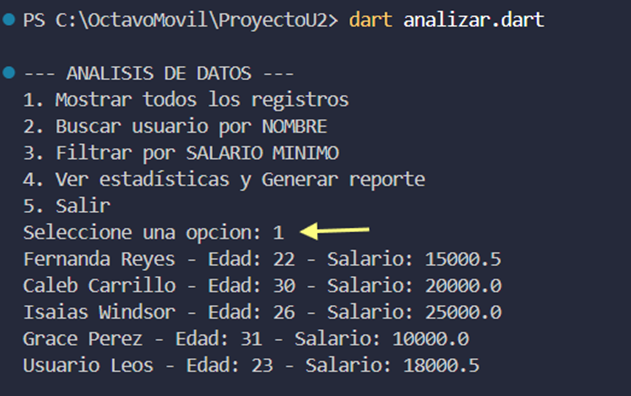
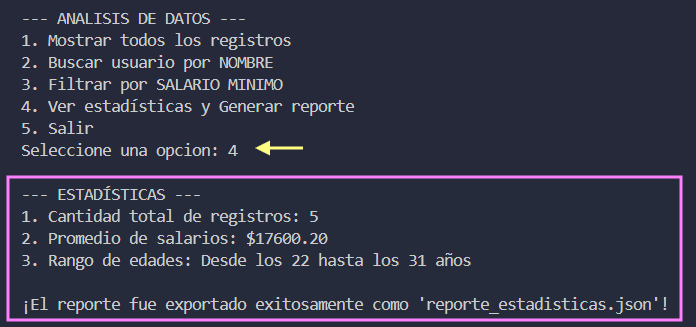
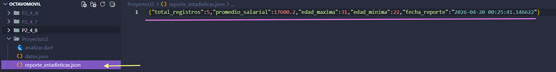

# Análisis de Datos con Dart

## 🎯 1. Objetivo del proyecto
Construir una aplicación de consola en Dart que cargue, procese y analice datos almacenados en formato JSON utilizando estructuras de control, funciones y clases de programación orientada a objetos.

## 🧩 2. Problema que resuelve 
Permite leer de forma automática archivos físicos de datos (`datos.json`) que contienen registros con información opcional o nula (Null Safety), procesando y ordenando la información para realizar búsquedas rápidas y evitar errores de ejecución en el sistema.

## 🛠️ 3. Tecnologías utilizadas 
* **Lenguaje:** Dart [cite: 768]
* **Librerías nativas:** `dart:io` (Lectura y escritura de archivos físicos) y `dart:convert` (Decodificación de formato JSON).

## 🧠 4. Conceptos aplicados 
* Modelado de datos mediante clases, constructores y métodos encapsulados (Getters).
* Control de valores nulos utilizando el operador de asignación por defecto (`??`).
* Iteración y filtrado de colecciones dinámicas mediante ciclos `for`, condicionales `if` y manejo de diccionarios (`Map`).
* Menús interactivos de consola utilizando estructuras de control cíclicas `while` y de selección `switch`.

## 📱 5. Capturas de pantalla 

## 🚀 6. Instrucciones de ejecución
1. Asegurarse de tener instalado el SDK de Dart.
2. Abrir la terminal de comandos dentro de esta carpeta.
3. [cite_start]Ejecutar la aplicación con el comando: `dart analizar.dart`.

## 💬 7. Reflexión personal
* **¿Qué aprendí?:** Aprendí a manipular archivos físicos e interpretar el formato JSON desde una aplicación de consola, además de la importancia de proteger el código contra valores nulos con Null Safety.
* **¿Qué fue difícil?:** Lo más complejo fue estructurar correctamente la lógica del cálculo matemático para las edades mínimas y máximas dentro del ciclo de lectura sin que se rompiera el flujo.
* **¿Qué mejoraría?:** En lugar de una interfaz de consola pura, mejoraría el proyecto adaptándole una interfaz gráfica móvil para desplegar las estadísticas en tarjetas visuales de Flutter.
