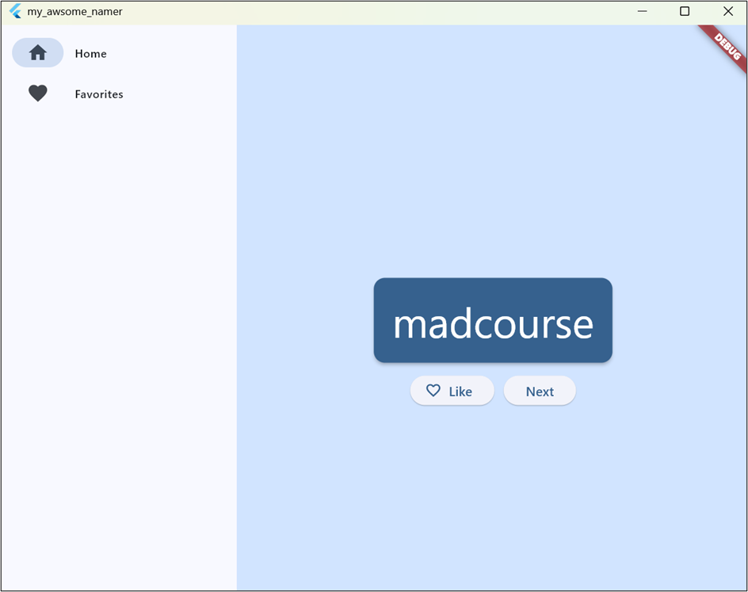
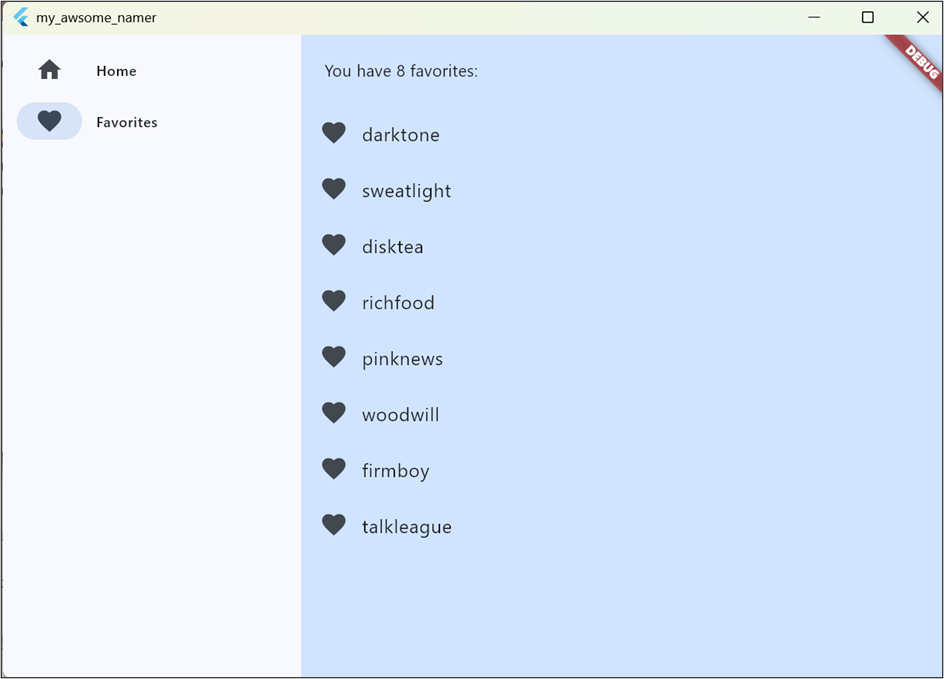
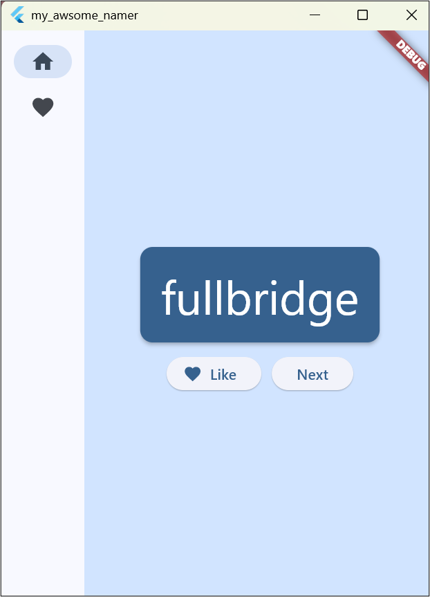

# Mi Primera Aplicación de Flutter 

## 🎯 1. Objetivo del proyecto
Aplicar los conceptos fundamentales de Flutter y Dart para concebir una aplicación móvil responsiva capaz de generar pares de palabras aleatorias y gestionar un estado interactivo local.

## 🧩 2. Problema que resuelve 
Suministra una interfaz de usuario fluida e interactiva que soluciona la gestión de estados globales, permitiendo al usuario guardar o eliminar favoritos en tiempo real sin perder la consistencia visual del diseño.

## 🛠️ 3. Tecnologías utilizadas 
* **Framework:** Flutter SDK 
* **Lenguaje:** Dart 
* **Paquetes externos:** `english_words` (para la creación de palabras) y `provider` (para la administración del estado reactivo).

## 🧠 4. Conceptos aplicados 
* Arquitectura basada en widgets con y sin estado (`StatefulWidget` / `StatelessWidget`).
* Gestión de estados reactivos utilizando `ChangeNotifier`, `context.watch` y notificación de escuchas (`notifyListeners`).
* Diseño responsivo adaptado mediante `LayoutBuilder` para modificar la UI (riel de navegación expandido o compacto) según el ancho de pantalla.
* Estilos globales, listas dinámicas con colecciones de flujo (`for` dentro de listas) y accesibilidad con `semanticsLabel`.

## 📱 5. Capturas de pantalla 

## 🚀 6. Instrucciones de ejecución
1. Ejecutar el comando `flutter pub get` en la terminal para instalar las dependencias.
2. Asegurarse de tener un emulador activo o dispositivo seleccionado.
3. Correr el proyecto con el comando: `flutter run`.

## 💬 7. Reflexión personal
* **¿Qué aprendí?:** Comprendí cómo funciona la programación declarativa en Flutter, el árbol de widgets y la importancia de separar la lógica de negocio usando el patrón Provider.
* **¿Qué fue difícil?:** Lo más complicado al principio fue entender la transición entre un widget estático y uno con estado para lograr que el menú lateral reaccionara al clic.
* **¿Qué mejoraría?:** Agregarle persistencia de datos local (como SQLite o Shared Preferences) para que las palabras marcadas como favoritas no se borren al cerrar por completo la aplicación.
