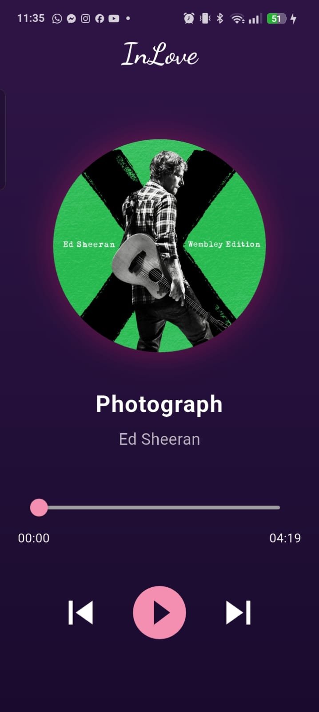
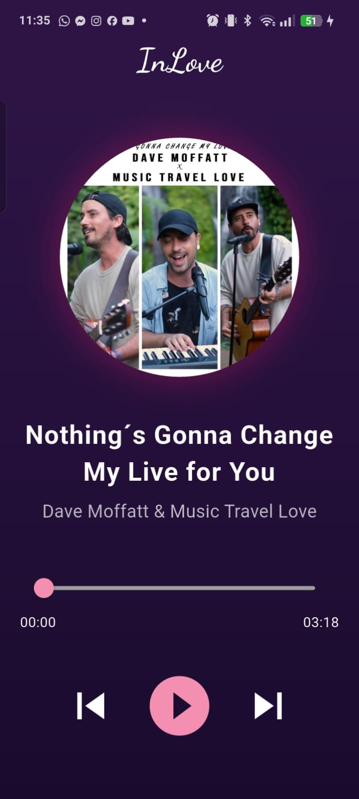
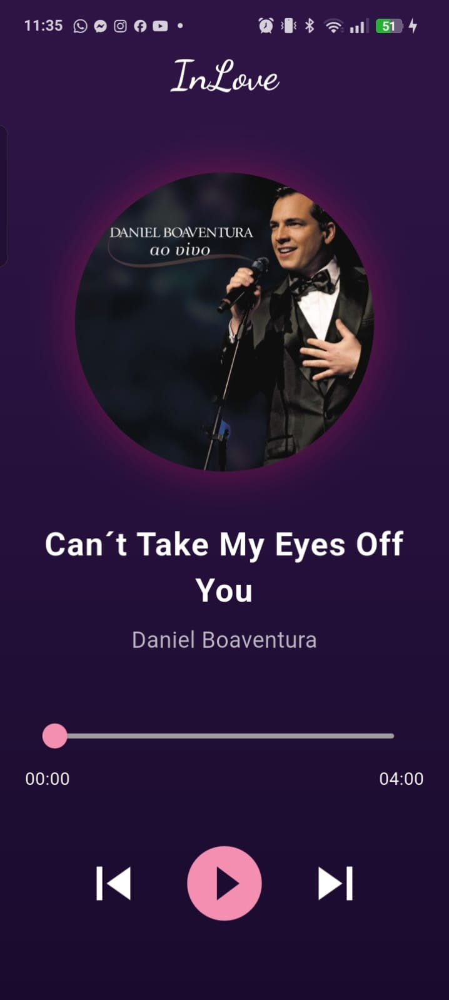

# Mini Reproductor de Musica 

## 🎯 1. Objetivo del proyecto
[cite_start]Desarrollar un reproductor de música móvil temático y totalmente interactivo utilizando herramientas multimedia nativas de Flutter para el control y enlace secuencial de archivos de sonido locales[cite: 1180, 1181, 1191].

## 🧩 2. Problema que resuelve 
[cite_start]Proporciona una solución multimedia autónoma capaz de procesar listas de reproducción reales sin bloqueos de memoria, automatizando el salto de canciones al concluir el tiempo y ofreciendo una experiencia inmersiva mediante respuestas visuales en tiempo real[cite: 1309, 1351, 1356, 1357].

## 🛠️ 3. Tecnologías utilizadas 
* [cite_start]**Entorno:** Flutter SDK & Dart [cite: 1191]
* [cite_start]**Paquetes multimedia:** `just_audio` (gestión del motor de sonido nativo) y `rxdart` (combinación avanzada de flujos de progreso)[cite: 1215, 1216].
* [cite_start]**Diseño:** `google_fonts` (Tipografía manuscrita estilizada para el AppBar)[cite: 1216, 1454].

## 🧠 4. Conceptos aplicados 
* [cite_start]Control de hilos multimedia y asincronía mediante Streams (`playerStateStream` y `positionStream`)[cite: 1350, 1422, 1425].
* [cite_start]Ciclo de vida estricto del widget inicializando y destruyendo procesos en memoria (`initState` y `dispose`)[cite: 1352, 1401, 1403].
* [cite_start]Animaciones fluidas continuas controladas matemáticamente por el reloj del sistema (`AnimationController` y `RotationTransition`)[cite: 1322, 1349, 1455].
* [cite_start]Diseño visual avanzado utilizando interfaces con degradados de color (`LinearGradient`), sombras neón (`BoxShadow`) y atenuaciones modernas (`withValues`)[cite: 1455, 1457].

## 📱 5. Capturas de pantalla 

## 🚀 6. Instrucciones de ejecución
1. [cite_start]Descargar las dependencias ejecutando `flutter pub get` en la terminal[cite: 1214].
2. [cite_start]Verificar que los archivos multimedia estén debidamente registrados en el `pubspec.yaml`[cite: 1217].
3. [cite_start]Conectar un dispositivo y compilar la app con el comando: `flutter run`[cite: 1210].

## 💬 7. Reflexión personal
* [cite_start]**¿Qué aprendí?:** Fue mi práctica favorita; aprendí a manipular recursos multimedia reales, coordinar animaciones con lógica asíncrona y utilizar el analizador de código para resolver advertencias de deprecación como el uso de `.withValues()`[cite: 1180, 1181, 1350, 1352].
* [cite_start]**¿Qué fue difícil?:** Lo más complicado fue lograr que el disco se detuviera de manera exacta en su ángulo actual al poner pausa y que se enlazara la playlist de forma automática al terminar la pista[cite: 1350, 1351].
* **¿Qué mejoraría?:** Me gustaría implementar una barra de búsqueda de canciones dentro de la playlist y permitir la carga de archivos de audio externos descargados directamente de internet.
